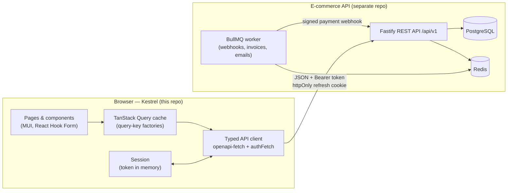
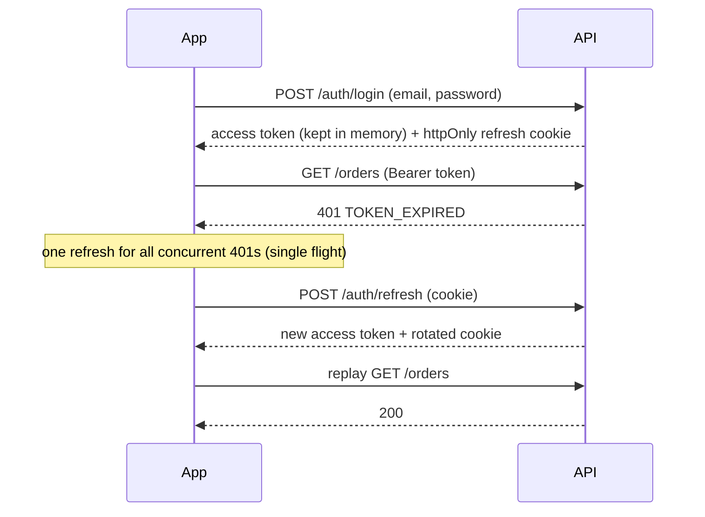
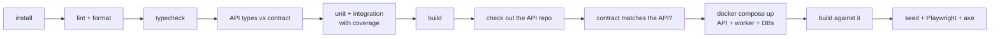

# Kestrel — E-commerce web app

[](https://github.com/JosueOmar320/ecommerce-web/actions/workflows/ci.yml)


A **storefront and back office** for the [E-commerce API](https://github.com/JosueOmar320/ecommerce-api),
built with React 19, TypeScript, TanStack Query and MUI. Everything the app shows comes from that API's
versioned REST contract. Nothing is mocked in the product, and where the API has no data for something
(product images, revenue figures), the UI says so instead of inventing it.

The focus is on what makes a shop work for real people: URLs that hold the state, a cart priced by
the server that explains price and stock changes, a checkout that cannot charge twice, an
asynchronous payment that the UI follows until the webhook lands, an admin where every action is
permission-aware, and accessibility verified in a real browser in both colour schemes.

---

## Contents

- [Highlights](#highlights)
- [Features](#features)
- [Tech stack](#tech-stack)
- [Architecture](#architecture)
- [Backend integration](#backend-integration)
- [State strategy](#state-strategy)
- [Accessibility](#accessibility)
- [Performance](#performance)
- [Testing](#testing)
- [Running locally](#running-locally)
- [CI/CD](#cicd)
- [Project structure](#project-structure)
- [API gaps and how the UI handles them](#api-gaps-and-how-the-ui-handles-them)
- [Screenshot plan](#screenshot-plan)
- [Future improvements](#future-improvements)

## Highlights

- **Contract-first:** TypeScript types are generated from the API's OpenAPI document, and CI fails
  if the committed contract and the generated types drift apart (or if the API changed its contract).
- **Session security:** the access token lives only in memory. The session is restored through
  the API's httpOnly refresh cookie, with a single-flight refresh on `401 TOKEN_EXPIRED`, sync
  across tabs through `BroadcastChannel`, and user-scoped caches dropped on logout or account switch.
- **Checkout that cannot double-charge:** order creation and payment send per-attempt
  `Idempotency-Key`s that are reused on retry. The payment is asynchronous: the UI polls until the
  provider's webhook (delivered by the API's worker) confirms or declines it.
- **URL as state:** filters, search, sort, pagination, checkout step and even the admin's stock
  drawer live in the URL. Malformed values are dropped, never forwarded to the API.
- **Accessibility measured, not assumed:** axe-core scans of every page in a real browser, in light
  and dark mode, run in CI (WCAG 2.2 AA tags, colour contrast included). The tests also fail on
  React's invalid-nesting warnings.
- **Two languages, no reload:** English and Spanish, with the preference persisted; the Spanish copy
  is a separate chunk loaded only for those who need it.

## Features

**Storefront**

- Home with categories, new arrivals and recently viewed products
- Catalog with server-side search, category tree, price range, availability and sort, all in the
  URL, with link-based pagination (crawlable, opens in new tabs)
- Product page with a variant picker that knows out-of-stock and impossible combinations
  (`?variant=SKU` deep links), JSON-LD, Open Graph and canonical tags
- Wishlist with optimistic updates and rollback, plus "move to cart"
- Cart priced by the API: per-line stock issues, a notice when a price changed since the item was
  added, and checkout blocked until the cart is ready

**Account**

- Checkout: shipping (saved addresses or a new one) → review → payment (mock provider with
  success/decline outcomes, clearly marked as test mode) → confirmation
- Orders: list with status filter; detail with fulfilment progress, payment attempts, status
  history, cancel (when the API allows it) and a printable invoice
- Profile: name, address book (create, edit, default, delete) and password change, which signs out
  every device because the API revokes all sessions

**Back office** (`/admin`, every page and action gated by its permission)

- Dashboard with exact counts from the API (orders, awaiting payment, to fulfil, low stock, active
  products, customers); each number links to the list behind it
- Products: list (search/status/category), create with variants and attributes, edit details,
  add/edit/delete variants (SKUs immutable), delete
- Categories: tree with create, edit (cycles prevented), delete
- Inventory: stock levels, low-stock filter, and a per-variant drawer with manual movements
  (purchase, return, adjustment) and the movement ledger
- Orders: every customer's orders, transitions exactly as the API allows them (with notes), refund retry
- Users: search, role and status filters, role editing and (de)activation, never of yourself

## Tech stack

| Concern      | Choice                                             | Why                                                                                                               |
| ------------ | -------------------------------------------------- | ----------------------------------------------------------------------------------------------------------------- |
| UI           | React 19, MUI 9                                    | Native `<title>`/`<meta>` hoisting; MUI's CSS-variable theming gives light/dark mode without a flash or re-render |
| Language     | TypeScript (strict, `noUncheckedIndexedAccess`)    | The API contract and translations are typed end to end                                                            |
| Build        | Vite 8 (Rolldown)                                  | Fast builds, route-level code splitting                                                                           |
| Routing      | React Router 8 (data router)                       | Lazy routes, scroll restoration, `flushSync` for discrete URL updates                                             |
| Server state | TanStack Query 5                                   | Query-key factories, `keepPreviousData`, optimistic updates, serialized cart mutations, polling                   |
| API client   | openapi-typescript + openapi-fetch                 | Types generated from `openapi/openapi.json`; one small fetch wrapper handles auth                                 |
| Forms        | React Hook Form + Zod                              | Schemas mirror the API's rules; server field errors map back onto fields                                          |
| i18n         | i18next + react-i18next                            | English source of truth; Spanish must have exactly the same keys (checked by `tsc`)                               |
| Tests        | Vitest, Testing Library, MSW, Playwright, axe-core | Integration tests through the real routes; E2E against the real API                                               |

## Architecture



The code is organised **by feature** (`src/features/catalog`, `cart`, `checkout`, `orders`,
`account`, `admin`, …). Each feature owns its API hooks (query options and mutations), components
and pages. Shared building blocks live in `src/components`, `src/lib` and `src/hooks`. Every page is
its own lazy chunk, and the whole back office is only downloaded by people allowed to open it.

## Backend integration

**Contract.** `openapi/openapi.json` is a copy of the API's contract (`npm run api:sync`), and
`src/api/schema.ts` is generated from it (`npm run api:generate`). Request bodies, parameters and
responses are all typed: a renamed field breaks the build, not production. CI checks both that the
generated types match the committed contract and that the contract matches the API being tested.

**Errors.** The API's envelope (`{ error: { code, message, details, requestId } }`) becomes an
`ApiError`. Messages are translated by code first, then by status, so users never see raw backend
text, and `VALIDATION_ERROR` details are mapped back onto the form fields that caused them.

**Authentication.**



On page load the session is restored through the same refresh call. If the refresh token is gone or
revoked, the app clears user data and explains on the login page why you were signed out (expired,
or password changed). Route guards are a UX convenience only: the API enforces every permission.

**Checkout and payments.** Each attempt to place an order or start a payment gets an
`Idempotency-Key` (kept in `sessionStorage`) that is reused if the request is retried after a network
error, so a flaky connection cannot create two orders or two charges. Payments are asynchronous: the
API answers `PENDING`, its worker later delivers the mock provider's signed webhook, and the payment
step polls the payment and the order until the outcome lands.

## State strategy

| State                                                   | Where it lives                                                                                                                                     |
| ------------------------------------------------------- | -------------------------------------------------------------------------------------------------------------------------------------------------- |
| Server data (catalog, cart, orders, admin lists)        | TanStack Query, one key factory per feature; user-scoped roots (`session`, `cart`, `wishlist`, `orders`, `account`, `admin`) are removed on logout |
| Filters, search, sort, page, checkout step, open drawer | The URL (validated on read)                                                                                                                        |
| Access token                                            | Memory only (`useSyncExternalStore` store), never storage                                                                                          |
| Theme and language                                      | `localStorage` (applied before first paint for the theme)                                                                                          |
| Idempotency keys                                        | `sessionStorage`, per attempt                                                                                                                      |
| Form drafts                                             | React Hook Form (local)                                                                                                                            |

Mutations update the cache from their responses when the API returns the new resource (cart, order
status, profile). They invalidate related data when the change affects more (stock after a
cancellation, storefront caches after an admin edit). Cart mutations share a mutation scope, so
quick successive changes are applied in order. The wishlist is optimistic, with rollback on error.

## Accessibility

Target: **WCAG 2.2 AA**.

- **Verified in a real browser:** Playwright runs `@axe-core/playwright` (WCAG 2.0/2.1/2.2 A and AA,
  plus best practices) on public, account and admin pages, in light and dark mode. The unit suite
  runs axe on key screens too (contrast excluded there, since jsdom cannot compute it).
- **Structure:** one `<h1>` per page, a correct heading order, landmarks, a skip link, and real
  `<table>`s with captions for data. Nested lists represent the category tree.
- **Keyboard and focus:** visible focus everywhere. Focus moves to step headings in checkout and to
  the page heading when an action removes its trigger (cancelling an order). Dialogs trap and
  restore focus, and a sticky header never hides the focused element (2.4.11).
- **Forms:** visible labels, inline errors tied to their fields, focus moved to the first invalid
  field on submit, `autocomplete` tokens, and password managers welcome (3.3.8).
- **Meaning not by colour alone:** status pills carry text, out-of-stock options are struck through
  and named, and links inside sentences are underlined.
- **Language:** `<html lang>` follows the selected language, so screen readers pronounce it correctly.
- **Motion:** `prefers-reduced-motion` is respected.

Issues found by these checks and fixed along the way include low-contrast placeholder text, MUI
subtitles rendering as `<h6>`, a `<div>` inside a `<p>`, navigation links outside `<li>`, accessible
names that did not contain the visible label, and links distinguished by colour only.

## Performance

Measured on the production build. "Initial" means the entry chunk plus everything it imports
statically, i.e. what the browser needs before the first render:

|                                          | Size (gzip)              |
| ---------------------------------------- | ------------------------ |
| Initial JavaScript (storefront, English) | **253 KB**               |
| Spanish copy (only for Spanish visitors) | 9.2 KB                   |
| Home / Catalog / Product page chunks     | 2.9 KB / 0.5 KB / 3.3 KB |
| Checkout chunk                           | 7.6 KB                   |
| Zod (only on routes with forms)          | 15.0 KB                  |
| Largest admin chunk (product editor)     | 14.6 KB                  |

What got it there:

- **Route-level splitting:** 99 chunks; every page and the whole back office load on demand.
- **No schema library on the first load:** env and URL parsing are small hand-written parsers, so
  Zod only loads on routes with forms. That took the initial JS from 276 to 253 KB gzip.
- **Language on demand:** non-default languages are fetched when needed and awaited before the
  first render, so there is no flash of English.
- **Data:** product queries prefetch on hover/focus, lists keep previous data while the next page
  loads, search is debounced, and caches are tuned per resource: the category tree for 10 minutes,
  lists for a minute, a product page for 15 seconds so stock stays current, and the cart always refetches.
- **No layout shift from media:** product placeholders have a fixed aspect ratio.

## Testing

| Suite              | Tool                         | What it covers                                                                                                                                                                                                                                 |
| ------------------ | ---------------------------- | ---------------------------------------------------------------------------------------------------------------------------------------------------------------------------------------------------------------------------------------------- |
| Unit + integration | Vitest, Testing Library, MSW | **122 tests**: the real routes and providers rendered against MSW handlers typed with the API's schemas (unhandled requests fail), plus pure logic (filters, variants, formatting, the auth client)                                            |
| End-to-end         | Playwright                   | **19 tests** on the production build against a real, freshly seeded API: catalog, auth, full checkout paid through the real webhook, invoice, wishlist, cancellation, admin product creation, stock movements, order transitions, phone layout |
| Accessibility      | axe-core                     | In unit tests and, with colour contrast, in Playwright for every page in light and dark mode                                                                                                                                                   |

Coverage of the unit/integration suite: **84.9% statements, 75.3% branches, 79.8% functions,
86.2% lines**.

```bash
npm test                 # unit + integration
npm run test:coverage    # with coverage report in coverage/
npm run test:e2e         # Playwright (needs the API running; see below)
```

## Running locally

**Prerequisites:** Node 24 and the [E-commerce API](https://github.com/JosueOmar320/ecommerce-api)
running on `http://localhost:3000` (its README covers `docker compose up --build`). The API allows
`http://localhost:5173` by CORS in development.

```bash
cp .env.example .env     # VITE_API_URL and VITE_SITE_URL
npm install
npm run dev              # http://localhost:5173
```

The API's seed creates demo accounts (development data only): `customer@example.com` and
`admin@example.com`, password `Password123!`.

**End-to-end tests locally.** Clone the API next to this repo (`../ecommerce-api`) and start it with
the E2E overrides (rate limiting off, preview origin allowed):

```bash
docker compose -f ../ecommerce-api/docker-compose.yml -f e2e/compose.e2e.yml up -d --build api worker
```

```bash
npm run build
```

```bash
E2E_SEED_COMMAND="docker compose -f ../ecommerce-api/docker-compose.yml -f e2e/compose.e2e.yml --profile seed run --rm seed" npm run test:e2e
```

The global setup re-seeds the database before the run (`E2E_SKIP_SEED=1` skips it). Without
`E2E_SEED_COMMAND` it runs `npm --prefix ../ecommerce-api run db:seed`.

| Variable                             | Purpose                                                                 |
| ------------------------------------ | ----------------------------------------------------------------------- |
| `VITE_API_URL`                       | Base URL of the API (no trailing slash)                                 |
| `VITE_SITE_URL`                      | Public origin of this app (canonical URLs, Open Graph)                  |
| `E2E_BASE_URL`                       | Run Playwright against an already running app instead of `vite preview` |
| `E2E_API_URL`                        | API used by the E2E setup (default `http://localhost:3000`)             |
| `E2E_SEED_COMMAND` / `E2E_SKIP_SEED` | How (or whether) to reset the API's data before E2E                     |

Both `VITE_*` variables are validated at startup and at build time; a missing or non-http(s) value
fails fast with a readable message.

## CI/CD



GitHub Actions (`.github/workflows/ci.yml`) runs on pushes to `main` and on pull requests. The E2E
job checks out the API repository (configurable with the `API_REPOSITORY` / `API_REF` variables),
starts it with Docker Compose plus `e2e/compose.e2e.yml`, and uploads the Playwright report and API
logs when something fails. Dependabot keeps npm packages and actions up to date.

The build is a static bundle (`dist/`), so any static host or CDN can serve it. Two things are
needed: a fallback to `index.html` for client-side routes, and the API's `CORS_ORIGINS` including
the app's origin (the refresh cookie is `SameSite=Strict`, so app and API should share a site).

## Project structure

```
src/
  api/            typed client (openapi-fetch), auth-aware fetch, errors, generated schema
  app/            providers, router, layouts (store and admin), error/404 pages
  components/     shared UI: SEO, empty/error states, dialogs, section cards, status pills…
  config/         validated environment
  features/
    auth/         session provider, guards, login/register
    catalog/      listing, filters (URL), product page, variants
    wishlist/  cart/  checkout/  orders/  account/  home/
    admin/        dashboard, products, categories, inventory, orders, users
  hooks/  lib/    URL filters, debouncing, formatting, idempotency keys, a11y helpers
  i18n/           i18next setup, en (source of truth) and es locales
  theme/          design tokens, light/dark colour schemes
test/             MSW handlers and typed fixtures, render helpers, axe helper
e2e/              Playwright specs, global setup (seed), compose override for the API
```

## API gaps and how the UI handles them

The UI only uses endpoints that exist. Where the API has no data, the app shows no invented content:

| Gap in the API                                                | How the UI handles it                                                                                        |
| ------------------------------------------------------------- | ------------------------------------------------------------------------------------------------------------ |
| No product images                                             | A typographic placeholder with a fixed ratio; it is the only component to change when images arrive          |
| No sales aggregates                                           | The dashboard shows exact counts and says why revenue is not shown (summing a paginated list would be wrong) |
| No PDF invoices                                               | The invoice is rendered from the API's data with print styles ("Save as PDF" from the print dialog)          |
| No password reset or email change                             | Not offered; the profile explains the email cannot be changed here                                           |
| Product list filters one status at a time                     | The admin status filter has no fake "All" option                                                             |
| Deleting a product removes it from admin lists too            | The UI calls it "Delete" and points to the Draft/Archived statuses for hiding a product temporarily          |
| Order status notes are free text from whoever made the change | Shown as written (system notes are in English)                                                               |

## Screenshot plan

Captures to add under `docs/screenshots/`, taken against the seeded API (1440×900 desktop,
390×844 phone), in English, light mode unless noted:

1. Home (desktop) and Home (dark mode)
2. Catalog with a category, price range and sort applied, URL visible
3. Product page with a variant selected and an out-of-stock option
4. Cart showing a price-change notice and a stock issue
5. Checkout payment step (test mode, declined then retry) and the confirmation
6. Order detail with progress, payments and the invoice dialog
7. Profile address book (phone)
8. Admin dashboard, product editor with variants, inventory drawer with the ledger
9. Admin order detail with status actions; users table on a phone
10. Spanish UI (catalog) to show the language switch

## Future improvements

- Split the back office's translations into their own lazily loaded namespace (about a third of the
  English copy that storefront visitors download today)
- Product images (needs API support) with responsive `srcset` and lazy loading
- Real payment provider integration (Stripe Elements) behind the same payment step
- Visual regression tests (Playwright screenshots) for the key pages
- Web Vitals reporting (LCP, INP, CLS) from real users
- Server-side rendering or pre-rendering of catalog pages for SEO beyond what crawlers execute

## License

All rights reserved. This repository is published as a portfolio piece.
